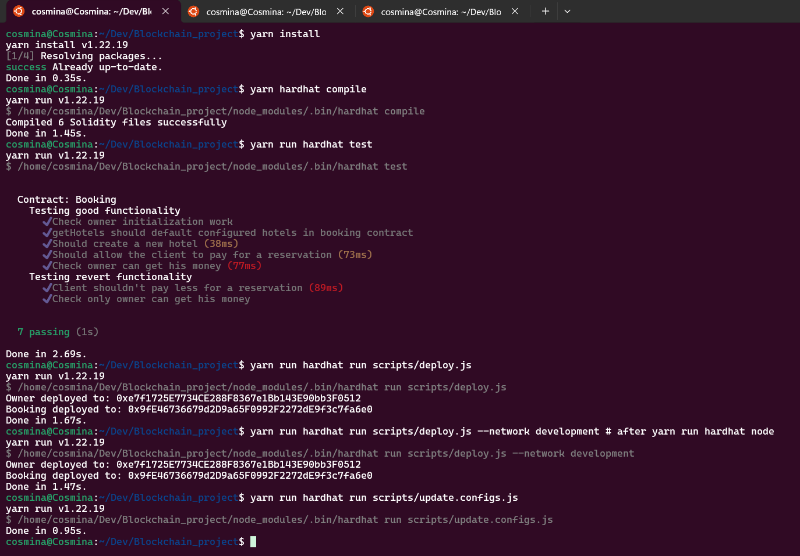

# Sample Hardhat Project

This project demonstrates a basic Hardhat use case. It comes with a sample contract, a test for that contract, and a Hardhat Ignition module that deploys that contract.

Try running some of the following tasks:

```shell
npx hardhat help
npx hardhat test
REPORT_GAS=true npx hardhat test
npx hardhat node
npx hardhat ignition deploy ./ignition/modules/Lock.js
```

Working with multiple node versions for differnt projects
- tutorial: https://snapshooter.com/learn/linux/working-with-node-js
```shell
$ # Using node v14.21.3 (npm v6.14.18)
$ nvm use lts/fermium
$ # Using node v22.2.0 (npm v10.7.0)
$ nvm use default
```

Start a RPC blockchain local node (network)
- it will print 20 addresses with 10000 ETH each
- 1st addressed is used by hardhad framework as default deployer
```shell
$ yarn run hardhat node
```


```shell
$ # deploy to on the fly hardhat network (not persisten / just for quick check)
$ yarn run hardhat run scripts/deploy.js [--network hardhat]
$
$ # deploy to local node network
$ yarn run hardhat run scripts/deploy.js --network development
$
$ # deploy to sepolia
$ yarn run hardhat run scripts/deploy.js --network sepolia
$
$ # copy smart contracts artifactories in frontend and update contract addresses automatically
$ yarn run hardhat run scripts/update.configs.js
```


